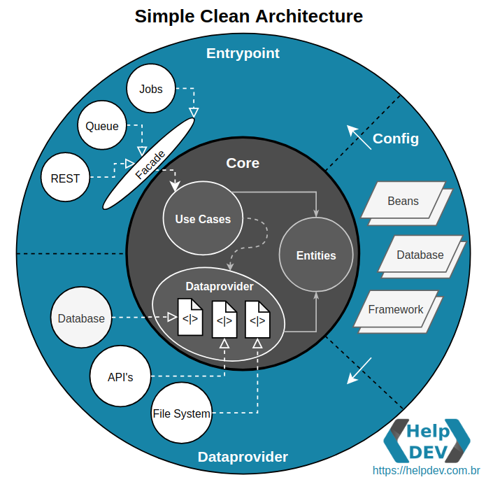
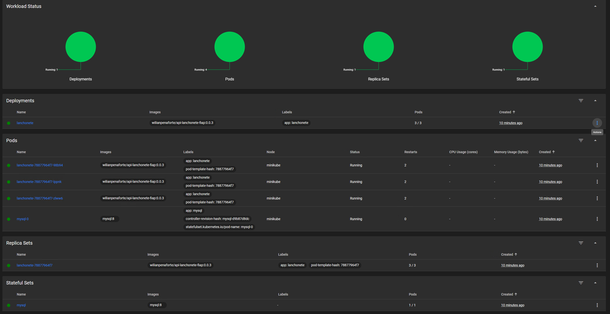
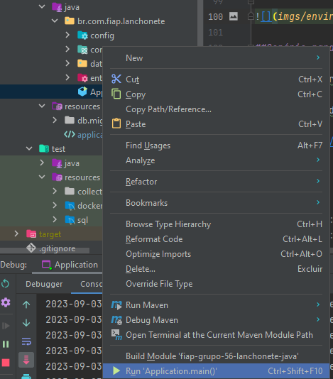

<div align="center">
  <h1>FIAP</h1>
</div>


## Projeto API Fast-Eats


[](https://sonarcloud.io/summary/new_code?id=FIAP-Grupo56-SOAT1_API_JAVA_FAST-EATS)

[](https://sonarcloud.io/summary/new_code?id=FIAP-Grupo56-SOAT1_API_JAVA_FAST-EATS) [](https://sonarcloud.io/summary/new_code?id=FIAP-Grupo56-SOAT1_API_JAVA_FAST-EATS) [](https://sonarcloud.io/summary/new_code?id=FIAP-Grupo56-SOAT1_API_JAVA_FAST-EATS)

[](https://sonarcloud.io/summary/new_code?id=FIAP-Grupo56-SOAT1_API_JAVA_FAST-EATS) [](https://sonarcloud.io/summary/new_code?id=FIAP-Grupo56-SOAT1_API_JAVA_FAST-EATS) [](https://sonarcloud.io/summary/new_code?id=FIAP-Grupo56-SOAT1_API_JAVA_FAST-EATS)

Este projeto consiste em uma API para uma lanchonete fictícia, desenvolvida como parte de um curso de arquitetura de software na FIAP.

## Documentação

O DDD do projeto segue o seguinte Event Storming:


O modelo acima foi criado utilizando a plataforma [Excalidraw](https://excalidraw.com), é possivel baixar o arquivo [Lanchonete DDD](docs/fase2/Lanchonete_DDD.excalidraw) e importar na plataforma para consultar ou aprimorar o modelo acima.

A documentação da API está disponível através dos seguintes links:

- Swagger: [http://localhost:8080/swagger-ui/index.html](http://localhost:8080/swagger-ui/index.html)
- OpenAPI: [http://localhost:8080/v3/api-docs](http://localhost:8080/v3/api-docs)

## Arquitetura

A arquitetura utilizada nesse projeto foi baseada na `Clean Architecture` porém mais flexível,
apenas com duas camadas, deixando a `core` totalmente isolada e livre de dependência de frameworks.

<p align="center">
    
</p>

- Mais detalhes sobre Simple Clean Architecture: https://medium.com/luizalabs/descomplicando-a-clean-architecture-cf4dfc4a1ac6

## Participantes do Projeto

Jairo Teles Almires - RM348743

Wesley Gomes da Silva - RM348588

Wilian Douglas dos Santos Penaforte - RM348563

## Executando o Projeto

### Variáveis de Ambiente

- Na raiz do projeto existe o arquivo [env-exemplo](env-exemplo) onde estão todas as variáveis de ambiente necessárias para a execução da aplicação.
- **`Para facilitar a avaliação do projeto pelos professores já deixamos pronto o arquivo .env com todas as variáveis necessárias.`**

### Executando com Kubernetes

Para executar o projeto, siga as instruções abaixo:

1. Certifique-se de ter o docker e minikube instalado na sua máquina, para mais informações https://minikube.sigs.k8s.io/docs/start/
2. Inicie o minikube:

```
 minikube start
```

3. instalar csi-hostpath-driver para que o minikube possa criar os volumes persistentes execute os dois comando abaixo:

```
 minikube addons enable csi-hostpath-driver
```

```
 minikube addons enable volumesnapshots
```

4. Para verificar a execução dos pods podemos utlizar o Dashboard do Kubernetes:

```
 minikube dashboard
```

5.Para aplicar os arquivos yaml no Kubernetes, siga as instruções abaixo, na raiz do projeto execute o comando:

```
 kubectl apply -f iniciar-projeto-lanchonente.yaml
```

6.Criar um tunnel para acesso:

```
 minikube tunnel
```

7.Aguarde a aplicação iniciar e acesse a URL abaixo. Pode demorar um pouco dependendo da configuracao da sua máquina:<br>
http://localhost:8080/swagger-ui/index.html

8.O minukube disponibiliza um dashboard para visualizar os recursos criados:
Pode verificar no endereco do dashboard no terminal onde foi executado o comando minikube dashboard


### Executando na IDE IntelliJ

Para executar o projeto, siga as instruções abaixo:<br>
Cetifique que o Mysql8.0 esteja executando com uma base de dados criada com as informações abaixo.

```
spring.datasource.url=jdbc:mysql://localhost:3306/fasteatsdb
spring.datasource.username=fiap56
spring.datasource.password=fiap56
```

1. abrir o diretório \src\main\java\br\com\fiap\fasteats\Application clique com o botão direito e Run 'Aplication.main()'
   

2. Aguarde a aplicação iniciar e acesse a URL abaixo.<br>
   http://localhost:8080/swagger-ui/index.html

## Cenário para testes

\*\*Observação: No momento para testar local com MERCADO_PAGO realizar chamada via endpoint simulador,
que simula o retorno via webhook, devido a aplicação não estar hospedada na web.

### Cenário 1 - Realizar um pedido de um X-Salada, informar o CPF 835.169.300-63 e pagar com Mercado Pago

1. Criar pedido<br>

swagger: http://localhost:8080/swagger-ui/index.html#/Pedido/criarPedido <br>
URL: http://localhost:8080/pedidos

```
{
    "cliente": {
        "cpf": "835.169.300-63"
    },
    "identificaCliente": true
}
```

Resposta esperada: 201<br>

```
{
  "id": 1,
  "cliente": {
    "cpf": "83516930063",
    "ativo": true
  },
  "dataHoraCriado": "2023-09-03T10:46:30.7927094",
  "valor": 0,
  "produtos": []
}
```

2. Adicionar um produto<br>

swagger: http://localhost:8080/swagger-ui/index.html#/Produto%20do%20Pedido/adicionarProduto <br>
URL: http://localhost:8080/produto-pedido/1/produtos

parâmetro path idPedido: 1 . Obs: usar o id do pedido da resposta anterior

```
{
  "idProduto": 1,
  "quantidade": 1
}
```

Resposta esperada: 200<br>

```
{
  "id": 1,
  "cliente": {
    "cpf": "83516930063",
    "ativo": true
  },
  "statusPedido": "CRIADO",
  "dataHoraCriado": "2023-09-03T11:51:25",
  "valor": 20,
  "produtos": [
    {
      "idProduto": 1,
      "nomeProduto": "X-SALADA",
      "descricaoProduto": "X-salada com um hamburger 180g",
      "quantidade": 1,
      "valor": 20
    }
  ]
}
```

3. Confirmar pedido<br>

swagger: http://localhost:8080/swagger-ui/index.html#/Pedido/confirmarPedido <br>
URL: http://localhost:8080/pedidos/1/confirmar?tipoPagamentoId=2

parâmetro path idPedido: 1 . Obs: usar o id do pedido da resposta anterior<br>
parâmetro query tipoPagamentoId: 2 . Obs: tipo 2 é mercado pago

```
idPedido: 1
tipoPagamentoId : 2
```

Resposta esperada: 200<br>

```
{
  "id": 1,
  "cliente": {
    "cpf": "83516930063",
    "ativo": true
  },
  "statusPedido": "AGUARDANDO_PAGAMENTO",
  "dataHoraCriado": "2023-09-03T16:59:14",
  "valor": 20,
  "qrCode": "00020126580014br.gov.bcb.pix0136b76aa9c2-2ec4-4110-954e-ebfe34f05b61520400005303986540520.005802BR5910pIuIAqzzxz6015OWBN rKn oQHXPb62230519mpqrinter13176119576304997D",
  "urlPagamento": "https://www.mercadopago.com.br/sandbox/payments/1317611957/ticket?caller_id=1446971994&hash=cf6fc255-b38b-4079-a1a1-740482343dfa",
  "produtos": [
    {
      "idProduto": 1,
      "nomeProduto": "X-SALADA",
      "descricaoProduto": "X-salada com um hamburger 180g",
      "quantidade": 1,
      "valor": 20
    }
  ]
}
```

4. Consultar pagamento <br>

swagger: http://localhost:8080/swagger-ui/index.html#/Pagamentos/consultarPagamentoPorIdPedido <br>
URL: http://localhost:8080/pagamentos/1/consultar-pagamento-por-id-pedido <br>

parâmetro path idPedido: 1 . Obs: usar o id do pedido<br>

```
idPedido: 1
```

Resposta esperada: 200<br>

```
{
  "id": 1,
  "formaPagamento": {
    "id": 2,
    "nome": "MERCADO_PAGO",
    "externo": true,
    "ativo": true
  },
  "statusPagamento": {
    "id": 4,
    "nome": "EM_PROCESSAMENTO",
    "ativo": true
  },
  "pedido": {
    "id": 1,
    "cliente": {
      "cpf": "83516930063",
      "ativo": true
    },
    "dataHoraCriado": "2023-09-03T16:59:14",
    "valor": 20,
    "produtos": []
  },
  "cliente": {
    "cpf": "83516930063",
    "ativo": true
  },
  "idPagamentoExterno": 1317611957,
  "qrCode": "00020126580014br.gov.bcb.pix0136b76aa9c2-2ec4-4110-954e-ebfe34f05b61520400005303986540520.005802BR5910pIuIAqzzxz6015OWBN rKn oQHXPb62230519mpqrinter13176119576304997D",
  "urlPagamento": "https://www.mercadopago.com.br/sandbox/payments/1317611957/ticket?caller_id=1446971994&hash=cf6fc255-b38b-4079-a1a1-740482343dfa",
  "dataHoraCriado": "2023-09-03T17:04:23",
  "dataHoraFinalizado": "2023-09-03T17:04:23"
}
Response hea
```

5. Efetuar simulacao de retorno de pagamento do mercado pago via webhook<br>

swagger: http://localhost:8080/swagger-ui/index.html#/Pagamento%20Externo/webhookPagamentoSimulacao <br>
URL: http://localhost:8080/pagamento-externo/mercadopago-webhook-simulacao?idPagamentoExterno=1317611957&mode=approved <br>
parâmetro query statusSimulacaoPagamento : approved . Obs: Status que vai ser simulado<br>
OBS: TROCAR "data":{"id": "1314618470"} POR idPagamentoErterno da consulta anterior, exemplo: "data":{"id": "1314618986"}

```
idPagamentoExterno : 1317611957
statusPagamentoMercadoPago : approved
```

Resposta esperada: 200<br>

```
{
  "id": 1,
  "formaPagamento": {
    "id": 2,
    "nome": "MERCADO_PAGO",
    "externo": true,
    "ativo": true
  },
  "statusPagamento": {
    "id": 3,
    "nome": "PAGO",
    "ativo": true
  },
  "pedido": {
    "id": 1,
    "cliente": {
      "cpf": "83516930063",
      "ativo": true
    },
    "dataHoraCriado": "2023-09-03T16:59:14",
    "dataHoraRecebimento": "2023-09-03T17:26:46.7519612",
    "valor": 20,
    "produtos": []
  },
  "cliente": {
    "cpf": "83516930063",
    "ativo": true
  },
  "idPagamentoExterno": 1317611957,
  "qrCode": "00020126580014br.gov.bcb.pix0136b76aa9c2-2ec4-4110-954e-ebfe34f05b61520400005303986540520.005802BR5910pIuIAqzzxz6015OWBN rKn oQHXPb62230519mpqrinter13176119576304997D",
  "urlPagamento": "https://www.mercadopago.com.br/sandbox/payments/1317611957/ticket?caller_id=1446971994&hash=cf6fc255-b38b-4079-a1a1-740482343dfa",
  "dataHoraCriado": "2023-09-03T17:26:45.2609683",
  "dataHoraFinalizado": "2023-09-03T17:26:45.2609683"
}
```

6)Iniciar o preparo na cozinha<br>

swagger: http://localhost:8080/swagger-ui/index.html#/Cozinha/iniciarPreparo <br>
URL: http://localhost:8080/cozinha-pedido/1/iniciar-preparo
parâmetro path id : 1 . Obs: id do Pedido

```
idPedido: 1
```

Resposta esperada: 200<br>

```
{
  "id": 1,
  "statusId": 5,
  "statusNome": "EM_PREPARO"
}
```

7)Finalizar o preparo na cozinha<br>

swagger: http://localhost:8080/swagger-ui/index.html#/Cozinha/finalizarPreparo <br>
URL: http://localhost:8080/cozinha-pedido/1/finalizar-preparo <br>

parâmetro path id : 1 . Obs: id do Pedido

```
idPedido = 1
```

Resposta esperada: 200<br>

```
{
  "id": 1,
  "statusId": 6,
  "statusNome": "PRONTO"
}
```

8)Retirar a entrega do pedido<br>

swagger: http://localhost:8080/swagger-ui/index.html#/Cozinha/retirarPedido <br>
URL: http://localhost:8080/cozinha-pedido/1/retirar <br>
parâmetro path id : 1 . Obs: id do Pedido

```
idPedido : 1
```

Resposta esperada: 200<br>

```
{
  "id": 1,
  "statusId": 7,
  "statusNome": "FINALIZADO"
}
```

### Fim do Cenário 1

### Cenário 2 - Realizar um pedido de um X-Salada, informar o CPF 835.169.300-63 e pagar com PIX

1. Criar pedido<br>

swagger: http://localhost:8080/swagger-ui/index.html#/Pedido/criarPedido <br>
URL: http://localhost:8080/pedidos

```
{
    "cliente": {
        "cpf": "835.169.300-63"
    },
    "identificaCliente": true
}
```

Resposta esperada: 201<br>

```
{
  "id": 1,
  "cliente": {
    "cpf": "83516930063",
    "ativo": true
  },
  "dataHoraCriado": "2023-09-03T10:46:30.7927094",
  "valor": 0,
  "produtos": []
}
```

2. Adicionar um produto<br>

swagger: http://localhost:8080/swagger-ui/index.html#/Produto%20do%20Pedido/adicionarProduto <br>
URL: http://localhost:8080/produto-pedido/1/produtos

parâmetro path idPedido: 1 . Obs: usar o id do pedido da resposta anterior

```
{
  "idProduto": 1,
  "quantidade": 1
}
```

Resposta esperada: 200<br>

```
{
  "id": 1,
  "cliente": {
    "cpf": "83516930063",
    "ativo": true
  },
  "statusPedido": "CRIADO",
  "dataHoraCriado": "2023-09-03T11:51:25",
  "valor": 20,
  "produtos": [
    {
      "idProduto": 1,
      "nomeProduto": "X-SALADA",
      "descricaoProduto": "X-salada com um hamburger 180g",
      "quantidade": 1,
      "valor": 20
    }
  ]
}
```

3. Confirmar pedido<br>

swagger: http://localhost:8080/swagger-ui/index.html#/Pedido/confirmarPedido <br>
URL: http://localhost:8080/pedidos/1/confirmar?tipoPagamentoId=1

parâmetro path idPedido: 1 . Obs: usar o id do pedido da resposta anterior<br>
parâmetro query tipoPagamentoId: 1 . Obs: tipo 2 é pix

```
idPedido: 1
tipoPagamentoId : 1
```

Resposta esperada: 200<br>

```
{
  "id": 1,
  "cliente": {
    "cpf": "83516930063",
    "ativo": true
  },
  "statusPedido": "AGUARDANDO_PAGAMENTO",
  "dataHoraCriado": "2023-09-03T17:52:35",
  "valor": 20,
  "produtos": [
    {
      "idProduto": 1,
      "nomeProduto": "X-SALADA",
      "descricaoProduto": "X-salada com um hamburger 180g",
      "quantidade": 1,
      "valor": 20
    }
  ]
}
```

4. Efetuar pagamento utilizando api da aplicação<br>

swagger: http://localhost:8080/swagger-ui/index.html#/Pagamentos/realizarPagamento <br>
URL: http://localhost:8080/pagamentos/1/realizar-pagamento<br>
parâmetro query statusSimulacaoPagamento : approved . Obs: Status que vai ser simulado<br>
parâmetro path idPedido: 1 . Obs: usar o id do pedido

```
idPedido  : 1

```

Resposta esperada: 200<br>

```
{
  "id": 1,
  "formaPagamento": {
    "id": 1,
    "nome": "PIX",
    "externo": false,
    "ativo": true
  },
  "statusPagamento": {
    "id": 3,
    "nome": "PAGO",
    "ativo": true
  },
  "pedido": {
    "id": 1,
    "cliente": {
      "cpf": "83516930063",
      "ativo": true
    },
    "dataHoraCriado": "2023-09-03T17:52:35",
    "valor": 20,
    "produtos": []
  },
  "cliente": {
    "cpf": "83516930063",
    "ativo": true
  },
  "dataHoraCriado": "2023-09-03T17:59:03.5404796",
  "dataHoraFinalizado": "2023-09-03T17:59:03.5404796"
}
```

5)Iniciar o preparo na cozinha<br>

swagger: http://localhost:8080/swagger-ui/index.html#/Cozinha/iniciarPreparo <br>
URL: http://localhost:8080/cozinha-pedido/1/iniciar-preparo
parâmetro path id : 1 . Obs: id do Pedido

```
idPedido: 1
```

Resposta esperada: 200<br>

```
{
  "id": 1,
  "statusId": 5,
  "statusNome": "EM_PREPARO"
}
```

6)Finalizar o preparo na cozinha<br>

swagger: http://localhost:8080/swagger-ui/index.html#/Cozinha/finalizarPreparo <br>
URL: http://localhost:8080/cozinha-pedido/1/finalizar-preparo <br>

parâmetro path id : 1 . Obs: id do Pedido

```
idPedido = 1
```

Resposta esperada: 200<br>

```
{
  "id": 1,
  "statusId": 6,
  "statusNome": "PRONTO"
}
```

7)Retirar a entrega do pedido<br>

swagger: http://localhost:8080/swagger-ui/index.html#/Cozinha/retirarPedido <br>
URL: http://localhost:8080/cozinha-pedido/1/retirar <br>
parâmetro path id : 1 . Obs: id do Pedido

```
idPedido : 1
```

Resposta esperada: 200<br>

```
{
  "id": 1,
  "statusId": 7,
  "statusNome": "FINALIZADO"
}
```

### Fim do Cenário 2

## Contribuindo

Contribuições são sempre bem-vindas! Se você quiser contribuir com o projeto, basta seguir os passos abaixo:

1. Faça um fork deste repositório.
2. Crie uma branch para a sua feature ou correção de bug: `git checkout -b minha-feature`.
3. Faça as alterações necessárias e adicione os commits: `git commit -m "Minha feature incrível"`.
4. Envie as alterações para o seu fork: `git push origin minha-feature`.
5. Abra um pull request para o repositório original.

# Autores

| [<br><sub>Wesley Gomes</sub>](https://github.com/Wesley-Gomes) | [<br><sub>Jairo Teles</sub>](https://github.com/hardtelles) | [<br><sub>Wilian Penaforte</sub>](https://github.com/wilianpenaforte) |
| :--------------------------------------------------------------------------------------------------------------------------------------: | :----------------------------------------------------------------------------------------------------------------------------------: | :--------------------------------------------------------------------------------------------------------------------------------------------: |
