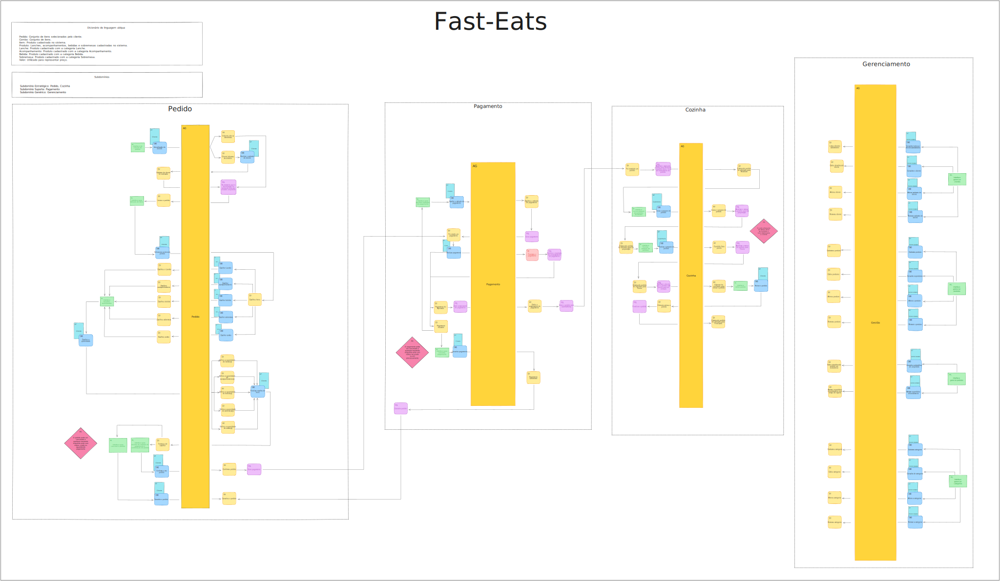

<div align="center">
  <h1>FIAP</h1>
</div>


## Projeto Microsserviço Produção de Pedidos API Fast-Eats


[](https://sonarcloud.io/summary/new_code?id=FIAP-Grupo56-SOAT1_MICROSERV_PRODUCAO_FAST-EATS)

[](https://sonarcloud.io/summary/new_code?id=FIAP-Grupo56-SOAT1_MICROSERV_PRODUCAO_FAST-EATS) [](https://sonarcloud.io/summary/new_code?id=FIAP-Grupo56-SOAT1_MICROSERV_PRODUCAO_FAST-EATS) [](https://sonarcloud.io/summary/new_code?id=FIAP-Grupo56-SOAT1_MICROSERV_PRODUCAO_FAST-EATS)

[](https://sonarcloud.io/summary/new_code?id=FIAP-Grupo56-SOAT1_MICROSERV_PRODUCAO_FAST-EATS) [](https://sonarcloud.io/summary/new_code?id=FIAP-Grupo56-SOAT1_MICROSERV_PRODUCAO_FAST-EATS) [](https://sonarcloud.io/summary/new_code?id=FIAP-Grupo56-SOAT1_MICROSERV_PRODUCAO_FAST-EATS) [](https://sonarcloud.io/summary/new_code?id=FIAP-Grupo56-SOAT1_MICROSERV_PRODUCAO_FAST-EATS)

Este projeto consiste em uma API para uma lanchonete fictícia, desenvolvida como parte de um curso de arquitetura de software na FIAP.

## Documentação

O DDD do projeto segue o seguinte Event Storming:


O modelo acima foi criado utilizando a plataforma [Excalidraw](https://excalidraw.com), é possivel baixar o arquivo [Lanchonete DDD](docs/fase2/Lanchonete_DDD.excalidraw) e importar na plataforma para consultar ou aprimorar o modelo acima.

A documentação da API está disponível através dos seguintes links:

- Swagger: [http://localhost:8082/swagger-ui/index.html](http://localhost:8082/swagger-ui/index.html)
- OpenAPI: [http://localhost:8082/v3/api-docs](http://localhost:8082/v3/api-docs)

## Arquitetura

A arquitetura utilizada nesse projeto foi baseada na `Clean Architecture` porém mais flexível,
apenas com duas camadas, deixando a `core` totalmente isolada e livre de dependência de frameworks.

<p align="center">
    
</p>

- Mais detalhes sobre Simple Clean Architecture: https://medium.com/luizalabs/descomplicando-a-clean-architecture-cf4dfc4a1ac6

## Participantes do Projeto

Jairo Teles Almires - RM348743

Wesley Gomes da Silva - RM348588

Wilian Douglas dos Santos Penaforte - RM348563

## Executando o Projeto

### Variáveis de Ambiente

- Na raiz do projeto existe o arquivo [env-exemplo](env-exemplo) onde estão todas as variáveis de ambiente necessárias para a execução da aplicação.
- **`Para facilitar a avaliação do projeto pelos professores já deixamos pronto o arquivo .env com todas as variáveis necessárias.`**

### Executando com Docker
Para realização dos testes de forma local foi criado um arquivo docker-compose na raiz de cada repositório de microsserviço, executando o docker-compose serão executados os 3 microsserviços necessários para a aplicação Fast-Eats funcionar totalmente e seus 3 bancos de dados.

Execute o comando abaixo no diretório raiz do projeto para executar a aplicação em conjunto com os demais serviços:

```bash
docker-compose up -d
```

# Autores

| [<br><sub>Wesley Gomes</sub>](https://github.com/Wesley-Gomes) | [<br><sub>Jairo Teles</sub>](https://github.com/hardtelles) | [<br><sub>Wilian Penaforte</sub>](https://github.com/wilianpenaforte) |
| :--------------------------------------------------------------------------------------------------------------------------------------: | :----------------------------------------------------------------------------------------------------------------------------------: | :--------------------------------------------------------------------------------------------------------------------------------------------: |
